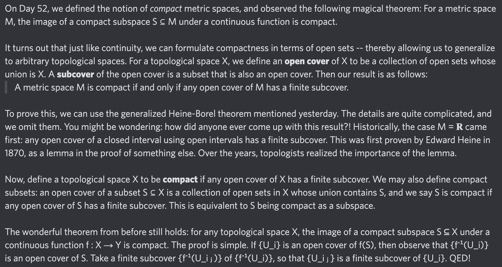

# Equation of The Day

# Day 86: [Compact space](https://en.wikipedia.org/wiki/Compact_space), part 2

$$\forall\{U_i\}\subseteq\mathcal T,\ \bigcup_iU_i=X\implies\exists i_1,\dots,i_n,\ \bigcup_{j=1}^nU_{i_j}=X$$

<picture></picture>

<a href="0085.html">#85</a> $\qquad\leftarrow\qquad$ #86 (February 4, 2025) $\qquad\rightarrow\qquad$ <a href="0087.html">#87</a>

[Back to Sector 2](../64-127.md)

