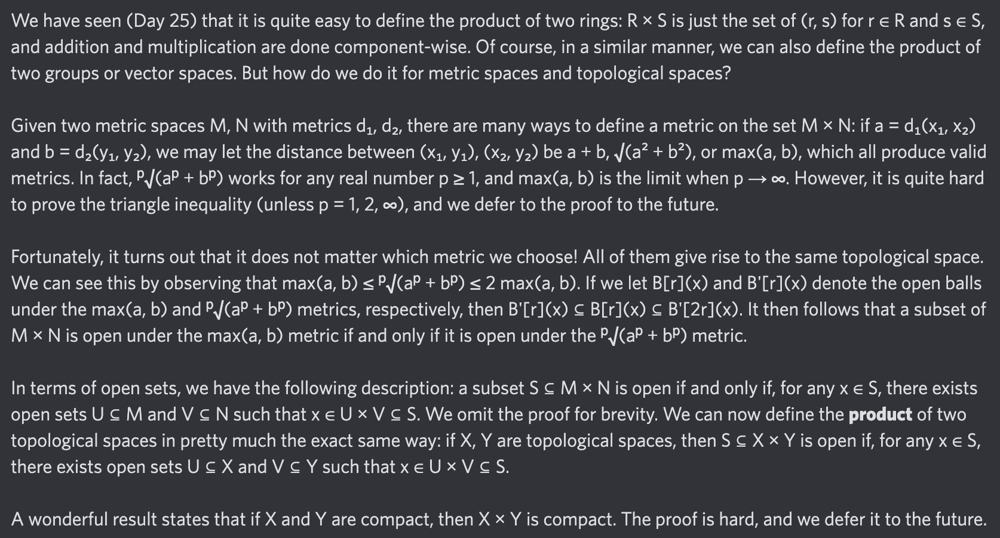

# Equation of The Day

# Day 87: [Product topology](https://en.wikipedia.org/wiki/Product_topology)

$$\mathcal T_{X\times Y}=\{S:\forall x\in S,\exists U\in\mathcal T_X,\exists V\in\mathcal T_Y,x\in U\times V\subseteq S\}$$

<picture></picture>

<a href="0086.html">#86</a> $\qquad\leftarrow\qquad$ #87 (February 7, 2025) $\qquad\rightarrow\qquad$ <a href="0088.html">#88</a>

[Back to Sector 2](../64-127.md)

