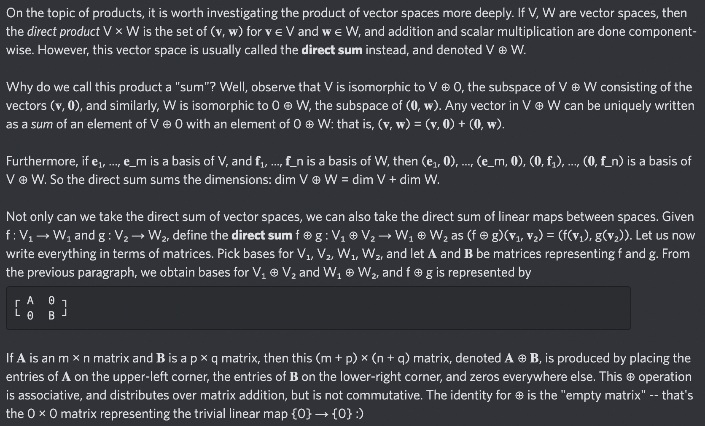

# Equation of The Day

# Day 88: [Direct sum](https://en.wikipedia.org/wiki/Direct_sum)

$$\mathbf A\oplus\mathbf B=\begin{bmatrix}\mathbf A&\mathbf0\\\mathbf0&\mathbf B\end{bmatrix}$$

<picture></picture>

<a href="0087.html">#87</a> $\qquad\leftarrow\qquad$ #88 (February 24, 2025) $\qquad\rightarrow\qquad$ <a href="0089.html">#89</a>

[Back to Sector 2](../64-127.md)

