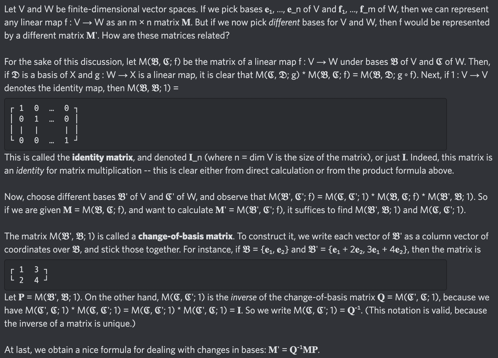

# Equation of The Day

# Day 89: [Change of basis](https://en.wikipedia.org/wiki/Change_of_basis)

$$\mathbf M'=\mathbf Q^{-1}\mathbf M\mathbf P$$

<picture></picture>

<a href="0088.html">#88</a> $\qquad\leftarrow\qquad$ #89 (February 26, 2025)

[Back to Sector 2](../64-127.md)

